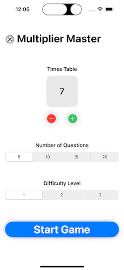
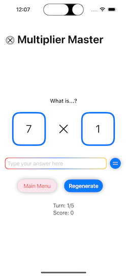

# Multiplication Table Game

A fun and customizable SwiftUI app designed to help children improve their multiplication skills.

## Features

* Choose a multiplication table to focus on (2 to 12)
* Select the number of questions (5, 10, 15, or 20)
* Adjustable difficulty levels for tailored practice
* Engaging animations and UI elements

## Getting Started

**Prerequisites:**
* Xcode (version 14 or higher recommended)
* Basic familiarity with Swift and SwiftUI

**Running the Project:**
1. Clone this repository: `git clone https://github.com/kevveth/MultiplicationTableGame`
2. Open the `.xcodeproj` file in Xcode.
3. Build and run the project on a simulator or iOS device.

## Project Insights

**Motivation:** I created this project as part of Paul Hudson's 100 Days of SwiftUI challenge. I wanted to build something fun and educational that would help children develop essential math skills.

**Learnings:** Throughout this project, I deepened my understanding of:
* SwiftUI layout and view modifiers
* Creating animations in SwiftUI
* Project planning and organization
* Error handling and debugging techniques

## Screenshots
Main Menu:

Gameplay: 

 

## Contributing

This project welcomes contributions! Please see our [CODE_OF_CONDUCT.md](CODE_OF_CONDUCT.md) for guidelines on how to participate respectfully. 

## License 

This project is licensed under the MIT License – see the [LICENSE.md](LICENSE.md) file for details.
